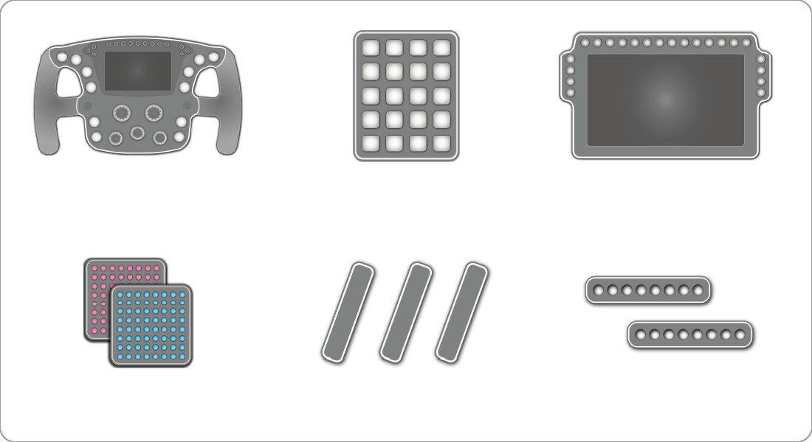
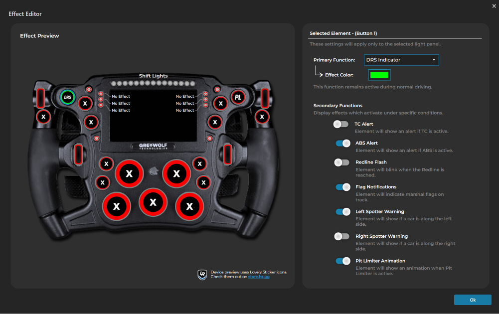

    <h1>ATSR-Hub EVO</h1>
    <h3>All-in-one lighting solution for SimHub</h3>
    

    <blockquote>
        „ATSR-Hub EVO - More than just fancy lighting“
          
        Using a custom LED framework, ATSR-Hub EVO includes advanced features to elevate your simracing experience. 
          
        Designed to be universally applicable, ATSR-Hub EVO works on virtually any SimHub compatible device!
    </blockquote>

     
     

    <h2>What's included?</h2>

    <h3>ATSR-Hub EVO includes profiles for ALL your devices!</h3>
    

    ATSR-Hub EVO uses a custom LED framework which allows for advanced telemetry and input driven effects and animations. Users will be able to fully customize the profiles to their needs.
     
     
    Every button, every encoder and every LED can be adjusted in behavior and color! Using ATSR-Hub EVO's <strong>Effect Editor</strong>, users will be able to adjust settings on the fly.

    

    ATSR-Hub EVO comes with all the features a Simracer needs! From TC, ABS and Spotter alerts to input based effects and car-specific shift lights for hundreds of cars across various games (Powered by the <a href="https://github.com/Lovely-Sim-Racing/lovely-car-data/tree/main/data">Lovely Car Data</a> repository - a joint project between <strong>ATSR, Lovely Sim Racing and Gomez Sim Industries</strong>).
     
     
     

    <h2>Installation</h2>

    Download the <a href="https://github.com/ATSR-Alex/ATSR-Hub-EVO/releases">latest plugin file</a> (<code>ATSR_Hub_EVO.dll</code>) and place it into your SimHub directory (<code>C:\Program Files (x86)\SimHub</code> by default). Verify that SimHub is closed before placing the file into the directory.
     
     
    Open SimHub and activate the ATSR-Hub EVO plugin. A prompt to activate should pop-up when starting SimHub. If this is not the case, click on <strong>Add/remove features</strong> on the left main menu and activate the plugin manually. It is recommended to enable the <strong>show in left main menu</strong> option for quick and easy access.
     
     
    ATSR-Hub EVO should now be visible in SimHub. You are now all set to use the plugin.
     
     
     

    <h2>Memberships</h2>

    Memberships have been introduced into ATSR-Hub EVO as an option to support this project. 
    ATSR-Hub EVO offers a great amount of profiles and features for free – Users who choose to support the development of the plugin will receive extra perks as a way of saying thank you.

    <h3>Premium Tier</h3>

    

    

        ✯ Unlimited Steering Wheel Profiles
    

    

        ✯ Unlimited Button Box Profiles
    

    

        ✯ Unlimited Matrix Profiles
    

    

        ✯ Unlimited Brow Profiles
    

    

        ✯ Unlimited DDU Profiles
    

    

        ✯ Unlimited Effect Presets
    

    

        ✯ 2 Additional Custom Themes
    

    

        ✯ 3 Additional Marshal Flag Styles
    

    

        ✯ Unlimited Custom Theme Presets
    

    

        ✯ Dual-Color Pit Limiter Animations
    

    <h3>Support ATSR and <a href="https://ko-fi.com/atsrprofiles" align:center> Become a Member </a> on Ko-fi</h3>

    <h2>License</h2>

    
    Copyright (c) 2025 Alexander Strallhofer

    This software is provided in binary form (.dll) and remains the intellectual property of Alexander Strallhofer.

    You may not:
    - Reverse engineer, decompile, or modify the software.
    - Redistribute or sell the software without written permission.

    THE SOFTWARE IS PROVIDED "AS IS", WITHOUT WARRANTY OF ANY KIND.

    By using this software, you agree to these terms.

